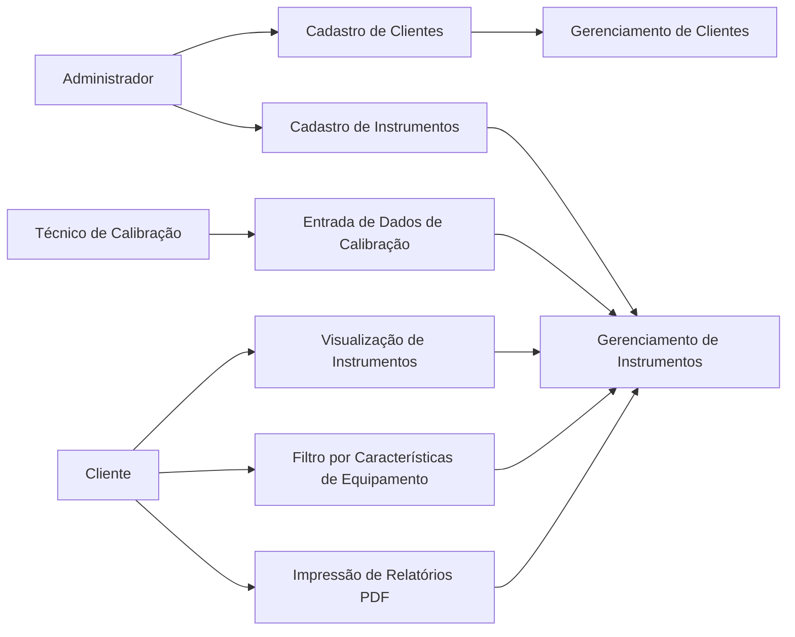
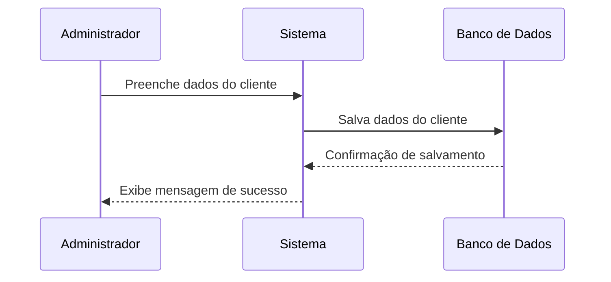
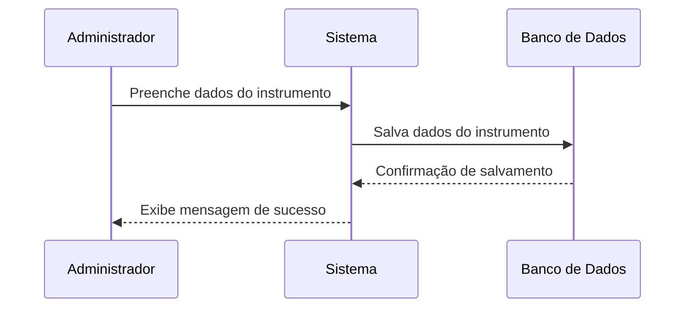
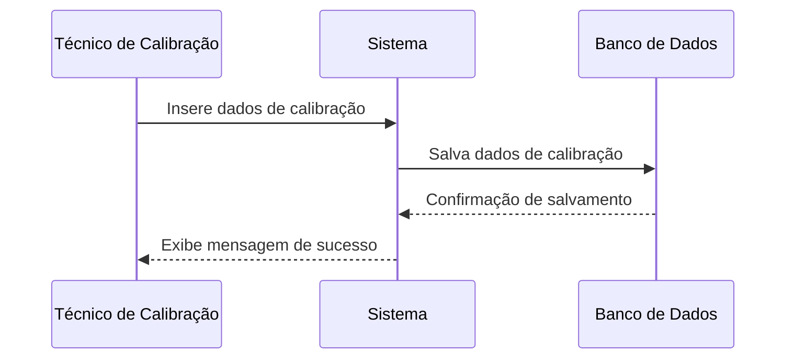
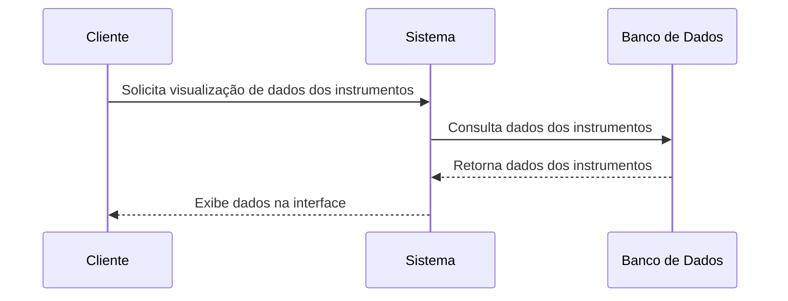
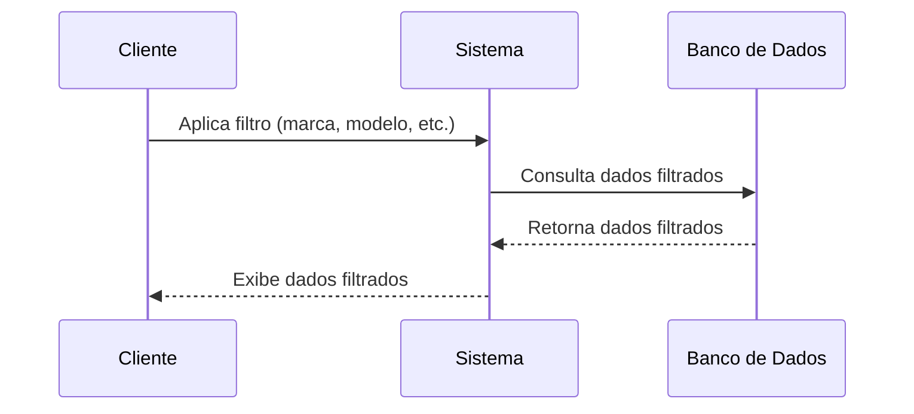
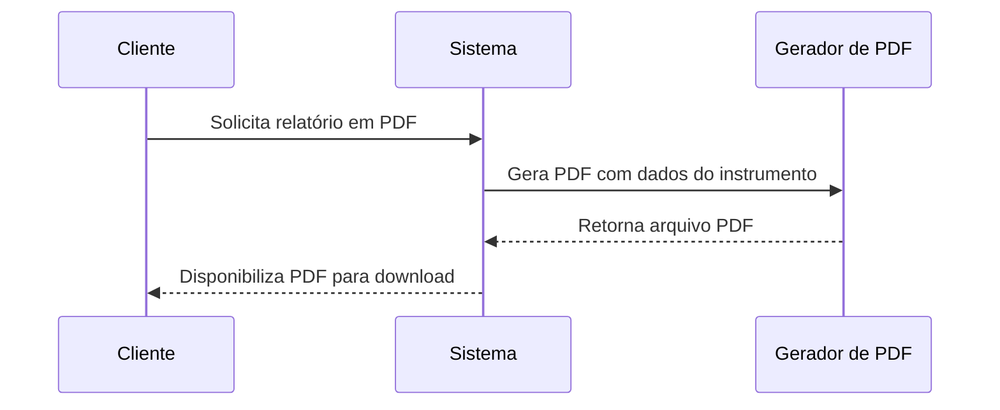

# Sistema Customizado: Casos de Uso

---

## 1. Descrição do Sistema

O sistema customizado da **NATALAB** é projetado para facilitar o gerenciamento de clientes e instrumentos, além de garantir a entrada e visualização dos dados de calibração de maneira eficiente e segura. O sistema oferece uma interface amigável para a equipe da NATALAB e seus clientes, permitindo o acesso a relatórios, a visualização de dados e a emissão de documentos em formato PDF.

---

## 2. Casos de Uso

### Caso de Uso: **Cadastro de Clientes**

- **Ator Principal**: Administrador
- **Descrição**: O administrador pode cadastrar novos clientes com informações como nome, CNPJ, endereço e contato. Os clientes podem posteriormente visualizar seus instrumentos e relatórios.
- **Ação Principal**: O administrador insere os dados no formulário e os salva no sistema, associando-os a um cliente.

### Caso de Uso: **Cadastro de Instrumentos**

- **Ator Principal**: Administrador
- **Descrição**: O administrador cadastra instrumentos pertencentes a cada cliente. Os instrumentos são identificados por número de série, marca, modelo e outras características.
- **Ação Principal**: O administrador associa um instrumento a um cliente e insere seus dados.

### Caso de Uso: **Entrada de Dados de Calibração**

- **Ator Principal**: Técnico de Calibração
- **Descrição**: O técnico insere os resultados de calibrações, datas e observações relevantes, diretamente no sistema para cada instrumento.
- **Ação Principal**: O técnico seleciona o cliente e o instrumento, insere os dados de calibração e os salva.

### Caso de Uso: **Visualização de Dados**

- **Ator Principal**: Cliente
- **Descrição**: O cliente, após login, pode visualizar os dados dos instrumentos e os resultados das calibrações realizadas.
- **Ação Principal**: O cliente acessa seu painel de controle e visualiza a lista de instrumentos, podendo clicar em cada um para ver os detalhes.

### Caso de Uso: **Filtro por Características de Equipamento**

- **Ator Principal**: Cliente
- **Descrição**: O cliente pode filtrar seus instrumentos por características como marca, modelo e status de calibração.
- **Ação Principal**: O cliente aplica os filtros e visualiza os resultados.

### Caso de Uso: **Impressão de PDF**

- **Ator Principal**: Cliente
- **Descrição**: O cliente pode gerar relatórios em PDF com os dados de calibração de seus instrumentos.
- **Ação Principal**: O cliente clica no botão de geração de PDF e o sistema prepara o arquivo com as informações do instrumento selecionado.

---

## 3. Diagrama UML de Casos de Uso

---

## 4. Diagramas de Sequência

### Diagrama de Sequência: Cadastro de Clientes

### Diagrama de Sequência: Cadastro de Instrumentos

### Diagrama de Sequência: Entrada de Dados de Calibração

### Diagrama de Sequência: Visualização de Dados

### Diagrama de Sequência: Filtro por Características de Equipamento

### Diagrama de Sequência: Impressão de Relatório PDF

---

### Explicação dos Diagramas

- **Cadastro de Clientes/Instrumentos**: O administrador insere os dados, que são salvos no banco de dados, e uma confirmação é exibida.
- **Entrada de Dados de Calibração**: O técnico insere os dados de calibração que são salvos no banco.
- **Visualização e Filtro de Dados**: O cliente solicita dados dos instrumentos e o sistema retorna as informações filtradas ou não, dependendo da interação.
- **Impressão de Relatório**: O cliente solicita a geração de um relatório em PDF, que é gerado e disponibilizado para download.

Esses diagramas mostram o fluxo de comunicação entre os diferentes atores e o sistema, com as interações com o banco de dados e outras funcionalidades.